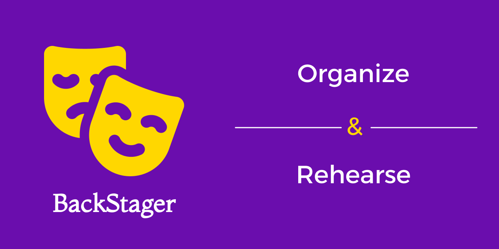

## 🎭 BackStager ⭐
"Break a leg!" - The BackStager Team



BackStager is a powerful, purpose-built Flutter application crafted specifically for the theater community. It's more than just a media organizer — it's your backstage assistant, designed to bring order, speed, and customization to the creative chaos of rehearsing.

With BackStager, users can effortlessly organize media files into fully customizable folders, tailored to the unique needs of each performer. But what truly sets it apart is its built-in audio player, complete with a Clip Highlights feature — empowering users to capture and save the most critical, memorable, or useful moments from any audio file in just a tap.

Whether it's saving cue lines, sound effects, or musical cues, BackStager puts creative control in the hands of any theater junkie.

This isn’t just an app — it’s the next must-have tool for your next rehearsal.

   &nbsp; 
  &nbsp;

 &nbsp;


 &nbsp;


## 📋 Prerequisites

Before you begin, ensure you have met the following requirements:
- Flutter 3.32.2
- Java 21 JDK
- Android SDK with:
  - Latest Platform Tools
  - Latest Command-line Tools
  - Build-Tools 34.0.0
- Physical Android device or emulator

## 🚀 Running the App in Dev Mode 👽
1. Connect your Android device via USB
2. Enable USB debugging in Developer options
3. Enable USB wireless debugging in Developer options (Only for wireless debugging)
4. Verify your device is recognized:
    ```terminal
       adb devices
       flutter devices
    ```

### Method 1: USB Debugging 🔌
1. While device conected (Or emulator running) and recognized, run:
   ```terminal
   flutter run -d <your_device_id> --debug
   ```
> Get device id when running flutter devices

### Method 2: Wireless Debugging :wireless:
1. While device conected and recognized, run:
   ```terminal
   adb tcpip 5555
   adb connect <device_ip>:5555
   ```

> Get device ip on Developer options > Debugging > Wireless debugging
2. Disconect and check availavility in host machine terminal
   ```terminal
   adb devices
   flutter devices
   ```

1. While device conected wirelessly and recognized, run:
   ```terminal
   flutter run -d <your_device_id> --debug
   ```

## :wrench: Build a release
### Generate APK
  ```terminal
  flutter build apk --release
  ```

made with ❤️ by HumbertoSaw
